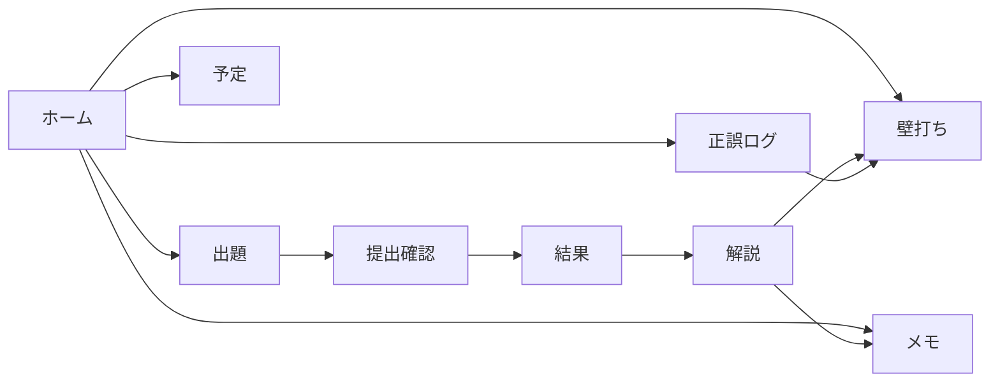

# 機能設計

対象: Azure-AZ104 ローカル試験アプリ（実装時点の仕様）  
利用者: 自分一人。認証なし。マシンローカルのみ。

操作手順の詳細は [manual.md](./manual.md)。モジュールと DB は [internal_design.md](./internal_design.md)。

---

## 1. 目的

AZ-104 を、パチスロ収支アプリを Azure に載せた世界線のオリジナル問題で、Udemy 型に解けるようにする。

同時に、試験日までの学習オペ（正誤の可視化、日次プラン、メモ、壁打ち）を同じアプリで完結させる。

収支管理アプリ（GCP 上の正本 SQLite）とはプロセスもデータも分ける。学習用に Azure へデプロイする話ではない。

---

## 2. 利用者と前提

| 項目 | 内容 |
|------|------|
| 利用者 | 受験者本人のみ |
| 端末 | 自分の Mac。ブラウザ |
| 認証 | なし |
| 公開 | `127.0.0.1:5104` のみ。LAN / クラウドに出さない |
| 問題 | オリジナル。公式・Udemy の転載禁止 |
| 合格表示 | 正答率 70% 目安。公式の 700 点スケールは再現しない |

---

## 3. 機能一覧

### 3.1 出題セット

- セット1 を 1 本だけ提供する（`questions/set01.json`）
- 60 問。領域は AZ-104 の配点比に寄せる（ID / ストレージ / コンピュート / ネットワーク / 監視）
- 各問: 選択肢 4 または 5、正解 1〜3 個
- 画面に「1つ選べ / 2つ選べ / 3つ選べ」を出す
- ホームに世界線（ケーススタディ）の短文を出す

### 3.2 試験モード

- 開始すると 60 問を JSON の並びで出題する（シャッフルしない。再現性優先）
- 提出するまで正解・解説を出さない
- 前後移動、番号パレット、フラグ、回答の途中保存
- 制限 100 分は表示上の目安。切れても続行可。強制提出しない
- 終了確認で「指定個数まで選んでいない問番号」を出す
- 採点後、総合点・領域別・解説レビューへ進む

### 3.3 練習モード

- 試験と同じ UI
- 各問で「答え合わせ」できる。その場で正誤と解説
- 答え合わせのたびに正誤ログへ 1 行残す
- 最後まで行けば試験と同様に提出・採点できる

### 3.4 採点ルール

- 1 問は集合の完全一致のみ正解。部分点なし
- 未回答は不正解
- 合格目安: 正答率 ≥ 70%
- 領域別の正解数 / 問数を結果に出す

### 3.5 正誤ログ

- 問題ごとに試行回数・正答率・最終日時
- 領域集計
- 最近の不正解（壁打ちへ飛べる）
- 提出済み受験の一覧（結果画面へ戻れる）
- 並びは正答率が低い順（弱点が上）

記録タイミング:

| きっかけ | 内容 |
|----------|------|
| 練習の答え合わせ | その 1 問 |
| 試験または練習の提出 | 全問（未回答含む） |
| アプリ起動 | ログ表が空で過去の提出があるとき、一度だけ埋め戻す |

同じ提出を二度採点しても、試験由来のログは受験 ID 単位で増えない。

### 3.6 学習スケジュール

- 試験日（今日以降）を保存する
- 「予定を作り直す」で今日〜試験日の日次プランを生成する
- 生成規則（利用者から見える動き）:
  - 5 領域を日替わり
  - 正誤ログがある場合、6 日に 1 回「弱点の追加日」
  - 直近 3 日は弱点解き直し → 60 問通し → 直前メモ
  - 残り 1〜2 日は短縮版
- 日ごとに未 / 済を切り替えられる
- ホームに「今日の予定」を出す
- ナビに試験日と残り日数を出す
- 「試験日だけ保存」は日付のみ更新し、日次行は消さない
- 「予定を作り直す」は日次行を全置換する（済も消える）

### 3.7 メモ

- 題名・本文。任意で問題 ID を紐づける
- 一覧・編集・削除
- 解説画面からもその問題向けに投稿できる
- 壁打ちで問題を選ぶと、紐づくメモをコンテキストに含める

### 3.8 壁打ち AI

- わからない語、他選択肢がダメな理由を日本語で聞く
- 問題を選ぶと、本文・選択肢・正解・解説・メモを渡す
- 公式問題・Udemy 文言の再現はさせない（システム指示）
- 会話は問題ごと（未選択なら全体スレッド）に残す。スレッド削除可
- キーは画面保存（ローカル SQLite）または環境変数 `GEMINI_API_KEY`
- 未設定時は送信不可
- 収支アプリの Gemini キーとは共有しない

### 3.9 ホーム要約

- セット開始フォーム
- 今日の予定
- 領域正答率
- 最近の受験 5 件
- 最近のメモ 4 件

---

## 4. 画面と主な操作

| 画面 | 経路 | できること |
|------|------|------------|
| ホーム | `GET /` | 開始、今日の予定、要約 |
| 出題 | `GET/POST /exam/<qid>` | 回答、フラグ、移動、練習の答え合わせ、終了へ |
| 提出確認 | `GET /finish` | 未完成問の確認 |
| 採点 | `POST /finish` | 提出 |
| 結果 | `GET /result/<id>` | 点数、領域バー |
| 解説 | `GET /review/<id>/<qid>` | 正誤対照、メモ、壁打ちへ |
| 正誤ログ | `GET /logs` | 集計、履歴 |
| 予定 | `GET/POST /schedule` | 試験日、生成、済トグル |
| メモ | `/memos` | CRUD |
| 壁打ち | `/coach` | キー保存、質問、スレッド削除 |

エラーは画面上部のフラッシュで返す（試験日不正、キー未設定、空質問など）。ログイン画面はない。

---

## 5. データ vis-à-vis 永続化（機能観点）

利用者が消したくないもの:

- 提出結果と正誤
- 試験日と日次プラン
- メモ
- 壁打ちの履歴と API キー

ブラウザを閉じても残る。git には載せない。問題本文は JSON 側でバージョン管理する。

---

## 6. 品質の受け入れ条件

- 60 問通し → 提出 → 解説が落ちない
- 練習の答え合わせでログが増える
- 試験提出で 60 行相当のログが付き、再提出しても試験ログは増えない
- 試験日を入れて予定を作ると、最終日が試験日になる
- メモが解説から保存でき、一覧に出る
- キー無しでは壁打ち送信ができない
- `127.0.0.1` 以外に bind しない
- 収支アプリの DB ファイルを開かない

---

## 7. やらないこと

- ユーザー登録、複数人、ランキング
- 問題のシャッフル出題（セット2 以降で検討可）
- 制限時間による強制提出
- ラボ（ポータル操作シミュレータ）
- 公式 700 点への換算
- 第 2 セット（Databricks 等）。JSON を足せる形にはしておく
- 本アプリ（収支）DB の参照、スクレイピング
- Cloudflare / IAP / 本番デプロイ

---

## 8. 関連文書

| 文書 | 役割 |
|------|------|
| [manual.md](./manual.md) | 起動と操作 |
| [internal_design.md](./internal_design.md) | 実装の内部 |
| [../questions/schema.md](../questions/schema.md) | 問題 JSON のフィールド |
| 収支アプリ `docs/az104_quiz_app_design.md` | 着手前の方針メモ（実装の正本はこのリポジトリ） |
| 収支アプリ `docs/az104_pachislot_practice.md` | 人間が通読する問題原案 |
