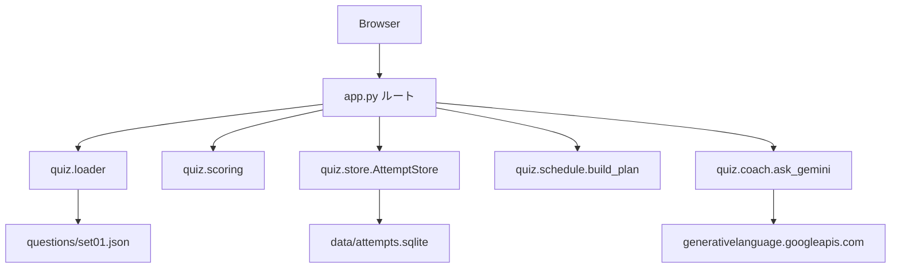
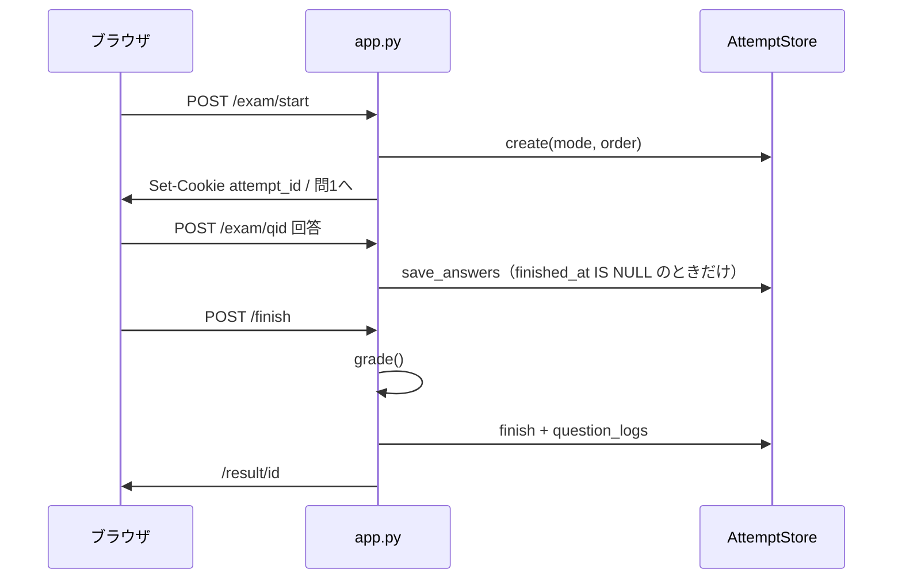

# 内部設計

対象: Azure-AZ104 の実装。機能の正本は [functional_design.md](./functional_design.md)。

---

## 1. 配置とプロセス

収支 git の **隣** に置く。同じ venv・同じ DB を使わない。

```text
Azure-AZ104/
  app.py                 Flask エントリ。host=127.0.0.1 port=5104
  quiz/                  ドメインロジック
  questions/set01.json   出題の正本
  templates/             Jinja
  static/css/quiz.css
  static/js/exam.js      複数選択の個数上限
  data/attempts.sqlite   実行時データ（gitignore）
  data/secret_key        cookie 署名（gitignore）
  tests/
  scripts/build_set01.py 問題 JSON の生成
```

依存は Flask のみ（`requirements.txt`）。SQLite と Gemini HTTP は標準ライブラリ。

起動:

```text
python3 app.py
→ create_app()
→ AttemptStore._init() でテーブル作成
→ question_logs が空なら過去の attempts から埋め戻し
→ 127.0.0.1:5104
```

`debug=False`。コード変更は再起動が必要。

---

## 2. モジュール分担



| モジュール | 責務 | やらないこと |
|------------|------|----------------|
| `app.py` | HTTP、セッション、フラッシュ、テンプレ引数 | SQL の詳細、採点式 |
| `quiz/loader.py` | JSON 読込、mtime キャッシュ、前後 ID | 採点 |
| `quiz/scoring.py` | 正誤、集計、未完成問番号 | I/O |
| `quiz/store.py` | SQLite CRUD、ログ埋め戻し | HTTP |
| `quiz/schedule.py` | 試験日から日次行を作る純関数 | DB |
| `quiz/coach.py` | Gemini REST | キーの永続化 |
| `scripts/build_set01.py` | 問題のソースから JSON を書く | 実行時には使わない |

`create_app(store_path=None)` はテスト用に SQLite パスを差し替えられる。モジュール末尾の `app = create_app()` が本番用。

---

## 3. セッションと受験の寿命

Cookie に持つのは Flask `session` の `attempt_id` だけ。署名鍵は `data/secret_key`（無ければ生成）。

回答本文・フラグ・採点結果は SQLite の `attempts` 行。



- 進行中の受験が無い `/exam/<qid>` はホームへ
- `finished_at` がある受験の出題 URL は結果へ
- 結果画面を開くと `session["attempt_id"]` をその受験に付け直す（解説ナビ用）
- 新しい開始は新しい `attempt_id`。古い進行中行は残るが cookie は上書き

制限時間のカウントダウン UI は未実装。`time_limit_min` は行に保存するだけ。

---

## 4. HTTP ルート

| メソッド | 経路 | 関数 | 副作用 |
|----------|------|------|--------|
| GET | `/` | `home` | なし |
| POST | `/exam/start` | `exam_start` | attempts INSERT、cookie |
| GET | `/exam/<qid>` | `exam_question` | なし |
| POST | `/exam/<qid>` | `exam_save` | answers/flags。practice+check なら logs |
| GET | `/finish` | `exam_finish_confirm` | なし |
| POST | `/finish` | `exam_finish` | 採点、finished_at、exam ログ |
| GET | `/result/<id>` | `result` | cookie 付け直し |
| GET | `/review/<id>/<qid>` | `review` | なし |
| GET | `/logs` | `logs` | なし |
| GET/POST | `/schedule` | `schedule` | settings / schedule_days |
| GET | `/memos` `/memos/<id>` | `memos` `memo_edit` | なし |
| POST | `/memos` | `memo_save` | memos |
| POST | `/memos/<id>/delete` | `memo_delete` | memos |
| GET/POST | `/coach` | `coach` | settings / chat / Gemini |

回答 POST の `action`:

- `next` / `prev` / `goto`（パレット） / `check` / `finish` / 省略（stay）

選択肢は `choice` の複数値。許可キー以外は捨て、`select_count` で切る。空選択は answers からその qid を消す。

日付の「今日」は `Asia/Tokyo`。SQLite の日時列は UTC ISO8601。予定の `date` は JST の暦日文字列。

---

## 5. 問題データの読み方

`load_set("set01")`:

1. `questions/set01.json` の mtime を見る
2. 同じならプロセス内 `_cache` を返す
3. 違えば読み直し、`_by_id` / `_by_no` を付ける

出題順は JSON 配列順。`attempts.question_order_json` にも同じ ID 列を保存するが、画面の前後は常に JSON 順（`neighbor_ids`）。将来シャッフルするなら両方を揃える必要がある。

フィールド契約は [schema.md](../questions/schema.md)。アプリは実行時に JSON Schema 検証はしない。

---

## 6. 採点

`quiz/scoring.py` は純関数。

```text
is_correct(answer, selected)  ⇔  set(answer) == set(selected)

grade(questions, answers):
  各問 selected = answers.get(id) or []
  ok / by_domain / details[]
  percent = round(100 * correct / total)

incomplete_questions:
  len(selected) != select_count の no を列挙
```

`details` はログと解説パレットのソース。`ok` は bool。

練習の画面上の正誤は、保存後に `?checked=1` で再表示し、その場で `is_correct` する。解説文は JSON の `explanation`。

---

## 7. SQLite スキーマ

ファイル: `data/attempts.sqlite`。`CREATE TABLE IF NOT EXISTS` のみ。マイグレーション枠は無い。

### attempts

| 列 | 型 | 意味 |
|----|-----|------|
| id | TEXT PK | 12 文字 hex |
| set_id | TEXT | `set01` |
| mode | TEXT | `exam` / `practice` |
| started_at | TEXT | UTC ISO |
| finished_at | TEXT | 提出まで NULL |
| time_limit_min | INTEGER | JSON からコピー |
| answers_json | TEXT | `{qid: ["A","C"], ...}` |
| flags_json | TEXT | `[qid, ...]` |
| question_order_json | TEXT | ID 配列 |
| result_json | TEXT | `grade()` の結果。未提出は NULL |

`save_answers` は `finished_at IS NULL` の行だけ更新する。

### question_logs

| 列 | 意味 |
|----|------|
| attempt_id | 紐づく受験。埋め戻しでも使う |
| qid / domain | 問題 |
| ok | 0/1 |
| selected_json | その回の選択 |
| source | `practice` または `exam` |
| logged_at | UTC ISO |

試験ログの二重防止: 同じ `attempt_id` に `source='exam'` が既にあれば INSERT しない。練習は都度増える。

`question_stats` は `GROUP BY qid, domain`。正答率昇順。

`weakest_domain` は領域正答率の最小。同率は `min` のキー順（Python 3.7+ で挿入順＝最初に見た領域）。

### settings

キー値。使用中:

- `exam_date` … `YYYY-MM-DD`
- `gemini_api_key` … 画面から保存したキー

### memos

`qid` は NULL 可。更新で `updated_at` だけ進める。

### schedule_days

`date` が PK。`replace_schedule` は DELETE 全件のあと INSERT。`done` は 0/1。トグルは SQL `CASE`。

### chat_messages

`qid` NULL = 全体スレッド。`role` は `user` / `assistant`。取得は新しい 40 件を古い順に返す。

---

## 8. スケジュール生成

`build_plan(exam_day, weak_domain, today)` は DB を見ない。

- `exam_day < today` → `[]`
- 1 日: 直前復習
- 2 日: 弱点 + 直前
- 3 日以上: 本体は日替わり 5 領域。`n > 3` なら末尾 3 日を特別日、`n == 3` なら末尾 2 日
- `i % 6 == 5` かつ弱点あり → その領域の「弱点の追加日」
- 特別日の問数目安: 24 / 60 / 10

`app.py` は `_today()`（JST）と `store.weakest_domain()` を渡す。

---

## 9. 壁打ち

キー解決順: SQLite の `gemini_api_key` → 無ければ `GEMINI_API_KEY`。画面保存は空文字も書き込む（キー削除に使える）。

`ask_gemini`:

- モデル `gemini-2.5-flash`
- `urllib.request`、タイムアウト 45 秒
- 直近 history 最大 12 件（今回の user 文は別途末尾に足すので、ルート側は「今回以外」を渡す）
- 問題付きなら stem / choices / 正解キー / explanation / メモを system ではなく user コンテキストに載せる
- 失敗は `RuntimeError`。ルートがフラッシュしてリダイレクト。user 行は先に INSERT 済みなので、失敗時も質問だけ残る

システム指示で公式問題の再現とキー漏洩案内を禁じる。

キーのマスク表示は末尾 4 文字。8 文字未満は「設定済」。

---

## 10. フロント

- テンプレは `templates/`。共通ナビは `base.html`
- 見た目は `static/css/quiz.css`（ダーク、Azure 青）。Bootstrap は使わない（収支アプリと脳内で混ぜない）
- `exam.js` は checkbox の選択数が `data-select-count` を超えたら直前のチェックを外す。サーバ側でも `[:select_count]` する
- パレットは出題中は submit ボタン、解説では `<a>`

---

## 11. セキュリティと境界

| 方針 | 実装 |
|------|------|
| 外部公開しない | `app.run(host="127.0.0.1", port=5104)` |
| 収支 DB を開かない | パスを持たない |
| 秘密を git に出さない | sqlite / secret_key / venv を gitignore |
| 回答改ざん | サーバが choice を許可キーに制限。採点はサーバ |
| XSS | Jinja 既定エスケープ。壁打ち応答も `pre` 内テキスト |
| API キー | 画面保存はローカル SQLite。ログに出さない。マスク表示 |

認証・CSRF トークンは入れていない（自分のループバック前提）。

---

## 12. テスト

`python3 -m unittest discover -s tests -v`

| ファイル | 見るもの |
|----------|----------|
| `tests/test_study.py` | 日程の日数と末尾 3 日、store の練習/試験ログ二重防止、メモ、キー無し coach |
| `tests/test_app_study.py` | 学習ページ 200、予定生成、メモ POST、練習 check でログ、キー無し壁打ち |

Flask テストは一時 SQLite。本番 `data/` は触らない。Gemini 実呼び出しはしない。

---

## 13. 既知の実装上の制約

- セット ID はルートが `set01` 固定。複数セット UI は無い
- `question_order_json` と画面順が将来ずれる余地
- 進行中受験の再開 UI は無い（cookie が残っていれば `/exam/<qid>` で戻れる）
- 試験ログの埋め戻しは「logs 表が空」のときだけ。途中で表が残ると古い未埋め戻し attempts は拾わない
- 壁打ち失敗時、user メッセージは残るが assistant は無い
- SQLite スキーマ変更は手作業（IF NOT EXISTS では列追加しない）

---

## 14. 拡張の入れ方

| やりたいこと | 入れる場所 |
|--------------|------------|
| セット2 | `questions/set02.json` + `load_set` とホームの選択 |
| 出題シャッフル | `exam_start` の order と `neighbor_ids` を attempt の order に合わせる |
| 制限時間切れ提出 | クライアント時計 + サーバ `started_at` の突き合わせ |
| スキーマ変更 | `_init` に `ALTER` か版テーブル |
